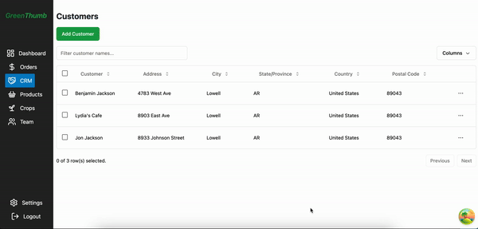
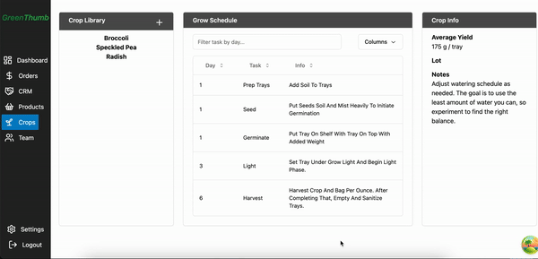
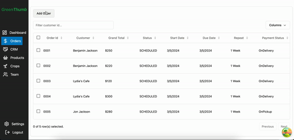
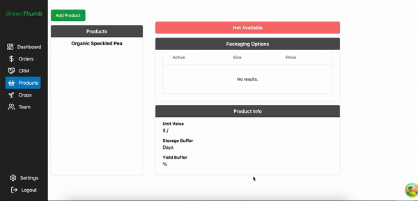
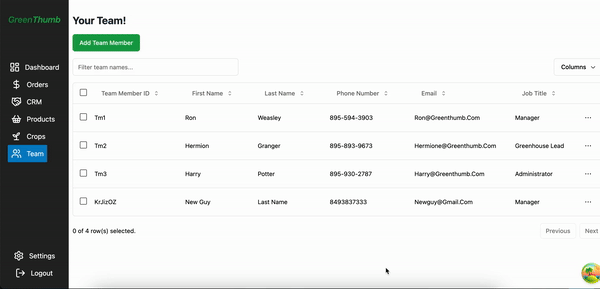

# Green Thumb

<a name="description"></a>

## Description

The purpose of this application is to provide microgreens business owners with an adminstrative tool to manage their customers, orders, crop grow schedules and task lists, and internal team management.

[](https://opensource.org/licenses/MIT)

## Table of Contents

- [Description](#description)
- [Installation](#installation)
- [Usage](#usage)
- [License](#license)
- [Contributing](#contributing)
- [Tests](#tests)
- [Questions](#questions)
- [Video](#video)
<!-- - [Screenshots](#screenshots) -->
- [Links](#links)
- [Resources / Credits](#credits)

<a name="installation"></a>

## Installation

- Clone the repository using:

```
git clone https://github.com/jonteal/GreenThumb.git
```

- Be sure that you are in the current working directory

```
cd client
```

```
npm install OR npm i
```

- Next, run the project by typing the following command in the terminal:

```
npm run mock
```

<a name="usage"></a>

## Usage

- In order to use the application the user can run the app locally.

<a name="license"></a>

## License

Permission is hereby granted, free of charge, to any person obtaining a copy of this software and associated documentation files (the "Software"), to deal in the Software without restriction, including without limitation the rights to use, copy, modify, merge, publish, distribute, sublicense, and/or sell copies of the Software, and to permit persons to whom the Software is furnished to do so, subject to the following conditions:

The above copyright notice and this permission notice shall be included in all copies or substantial portions of the Software.

THE SOFTWARE IS PROVIDED "AS IS", WITHOUT WARRANTY OF ANY KIND, EXPRESS OR IMPLIED, INCLUDING BUT NOT LIMITED TO THE WARRANTIES OF MERCHANTABILITY, FITNESS FOR A PARTICULAR PURPOSE AND NONINFRINGEMENT. IN NO EVENT SHALL THE AUTHORS OR COPYRIGHT HOLDERS BE LIABLE FOR ANY CLAIM, DAMAGES OR OTHER LIABILITY, WHETHER IN AN ACTION OF CONTRACT, TORT OR OTHERWISE, ARISING FROM, OUT OF OR IN CONNECTION WITH THE SOFTWARE OR THE USE OR OTHER DEALINGS IN THE SOFTWARE.

<a name="contributing"></a>

## How to Contribute

1. [Fork the repo!](https://docs.github.com/en/get-started/quickstart/fork-a-repo)
2. Create a feature branch:

```
git checkout -b yourname-branch
```

3. Commit changes:

```
git commit -m 'Your changes here'
```

4. Push to the branch:

```
git push origin yourname-branch
```

5. Submit a pull request and wait for it to be approved or denied.

<a name="tests"></a>

## Tests

No tests available at this time.

<a name="questions"></a>

## Questions

If you have any questions or comments, please feel free to contact me by email:

- Jon Jackson - jonjackson.webdesign@gmail.com

<a name="video"></a>

## Video

#### Adding a Customer



#### Adding a Crop



#### Adding an Order



#### Adding an Product



#### Adding a Team Member



<!-- <a name="screenshots"></a> -->

<!-- ## Screenshots

<a name="links"></a> -->

## Links

Github Repository: https://github.com/jonteal/GreenThumb
